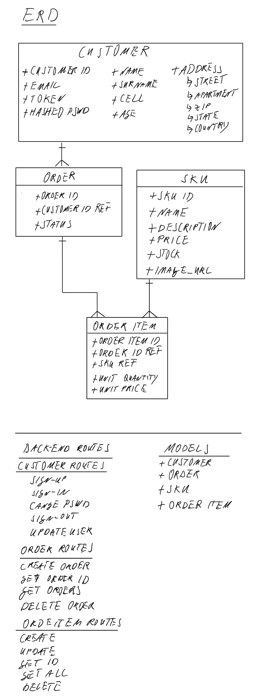

# E-Commerce Platform: Food4U

## Background

The genesis of Food4U is to add local distribution channels for farmers and to offer locally farmed seasonal produce to customers.
### Company Story
We pride ourselves in delivering fresh produce to your home! All our products are sourced exclusively from local farmers. This has the added benefit of being environmentally friendly. Our produce is local and seasonal so please bear with us if items are currently unavailable - our farmers are working hard on the next harvest! It goes without saying that all our farmers are exclusively No-GMO and all produce is certified organic. Save time by shopping on our app and we will deliver the products right to your home. We use Stripe to process your payment.

## Back-End Application
This repo is the backend of the project. It was written in Node.js and uses Express to handle the routes for the various requests. Mongoose and MongoDB are used for database storage of user generated and company data. Other libraries and frameworks used include Stripe, bcrypt, cors, passport, and passport-http-bearer.

## Hosted Applications
### Back-end
The back-end is deployed on [Heroku](https://salty-beyond-56482.herokuapp.com/) and the repository can be found on [GitHub](https://github.com/Tech-It-Out/food4u-api)

### Front-end
The front-end app is hosted on [GitHub Pages](https://tech-it-out.github.io/Food4U-client/#/) and the repository can be found on [GitHub](https://github.com/Tech-It-Out/Food4U-client)

## Entity Relationship Diagram
The api manages 4 main resources.
1. The customer is the primary resource
1. Each customer has a 1-to-many relationship with the order resource. Orders are a different collection with an ID reference to the customer owner
1. Each order has a 1-to-many relationship with the order item resource. Order items are stored as sub-documents inside an orderItem array on the order resource. Each order-item represents exactly one product. The order item specifies the product_id, the quantity, and the price associated with the parent order.
1. Each order item also references exactly one productId. The product or Stock Keeping Unit (SKU) is the source for the product name, description, price, and the related product image.

## Routes
### User / Customer

Verb | URI | Body | Headers | Status Response | Body Response
--- | --- | --- | --- | --- | ---
POST | /sign-up | credentials | token | 201, Created | sign up user
POST | /sign-in | credentials | token | 201, Created | sign in user
PATCH| /change-password| credentials | token | 204, No Content | change user password
DELETE | /sign-out | credentials | token | 204, No Content | delete user
PATCH| /update | credentials | token | 200, OK | update user

### Order

Verb | URI | Body | Headers | Status Response | Body Response
--- | --- | --- | --- | --- | ---
GET | /orders | n/a | token | 200, OK | show orders
GET | /orders/:id | n/a | token | 200, OK | show order
POST | /orders | order object with status cart| token | 201, CREATED | create order
PATCH | /orders/:id | order object | token | 204, No Content | update order
DELETE| /orders/:id | n/a | token | 204, No Content | delete order

### Order Item

Verb | URI | Body | Headers | Status Response | Body Response
--- | --- | --- | --- | --- | ---
POST | /orderItem | order item object | token | 201, Created | create order item
PATCH | /orderItem/:id | order item object | token | 201, Created | update order item
DELETE | /orderItem/:id | n/a | token | 204, No Content | delete order item

### Product
Please note that these routes are not customer facing and are only to be used by the site admin!

Verb | URI | Body | Headers | Status Response | Body Response
--- | --- | --- | --- | --- | ---
GET | /products | n/a | token | 200, OK | show products
GET | /products/:id | n/a| token | 200, OK | show product
POST | /products | product item object | token | 201, CREATED | create product
DELETE | /products/:id| n/a | token | 204, No Content | delete product
  
  
  
### Stripe Checkout

Verb | URI | Body | Headers | Status Response | Body Response
--- | --- | --- | --- | --- | ---
POST | /create-checkout-session | checkout object data | token | 200, OK | redirect to checkout payments page

#### Stripe Checkout logic
For security reasons, the team built the checkout on the back-end. This prevents malicious interjecting of data on the front-end. All checkout parameters such as total price are calculated on the back-end and passed to the front-end. There are three core parts to the checkout:
- Post route that contains the body of the data being sent
- Only authenticated users (tokenised) can be approved for checkout
- Custom middleware (`get_total_due_from_cart.js`), built by the team, passes the user and correct cart data in order to provide total price charged to Stripe's hosted checkout page.
- If payments processing was successful, customers get redirected to their order history page, showing the most recent order at the top. Users stay logged in throughout the progress by storing the user token in session storage on the front end. The front end then calls most recent order history to display to the customer.
- If payment processing was unsuccessful, customers get redirected to their cart.

## Planning Documentation
The development team used GitHub's project management [Kanban](https://github.com/orgs/Tech-It-Out/projects/2?add_cards_query=is%3Aopen) for macro project development and planning purpose.

For back-end specific planning issues the team used GitHub's project management [Kanban](https://github.com/Tech-It-Out/food4u-api/projects) that sits inside the repo.

## Next Development Phase
1. Build a stock-keeping / inventory balance into the product collection such that customers can only check out items / add items to the cart that are in stock.
1. instead of using Stripe's hosted payment page, build proprietary one that enables the customer to never leave the company website
1. Store product images in dedicated storage solution instead of Imgur
1. Add favourites resource
